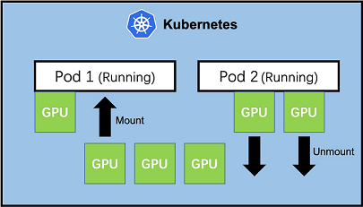

# K8s Device Mounter

K8s-Device-Mounter is a kubernetes plugin that can dynamically add or remove device resources running Pods.

<div align="center">  </div>

## Features

* Supports add or remove Device resources of running Pod without stopping or restarting
* Compatible with kubernetes scheduler
* Compatible with kubernetes device plugin
* Compatible with cgroup v1 and cgroup v2

## Prerequisite 

* Kubernetes v1.22+ (other version not tested)
* Docker / Containerd (other version not tested)
* runc based container runtime
* cert-manager (Ensure that certificate manager is installed in the cluster and will be used to distribute self signed certificates)

## Supported devices

* Nvidia GPU device plugin: Support NVIDIA native device resource scheduling
> `nvidia-container-runtime` (must be configured as default runtime)

* Valcano VGPU device plugin: VGPU hot mount implementation supporting Valcano scheduler
> `nvidia-container-runtime` (must be configured as default runtime)

* Ascend NPU device plugin: Under development
> `ascend-docker-runtime` (must be configured as default runtime)


## Deploy

* Installing Cert Manager. [GitHub](https://github.com/cert-manager/cert-manager)

* label nodes with `device-mounter=enable`

```shell
kubectl label node <nodename> device-mounter-enable=enable
```

* deploy

```bash
kubectl apply -f deploy/device-mounter-apiserver.yaml
kubectl apply -f deploy/device-mounter-daemonset.yaml
```

* uninstall

```shell
kubectl delete -f deploy/device-mounter-apiserver.yaml
kubectl delete -f deploy/device-mounter-daemonset.yaml
```

* generate grpc api

```shell
 protoc --go_out=. --go-grpc_out=. pkg/api/api.proto
```

## Quick Start

Nvidia GPU Device Plugin. See [Nvidia_GPU Using Help](docs/guide/NvidiaGPU.md)

Volcano vGPU Device Plugin. See [Volcano_VGPU Using Help](docs/guide/VolcanoVGPU.md)

Ascend NPU Device Plugin. See [Ascend_NPU Using Help](docs/guide/AscendNPU.md)

## FAQ

See  [FAQ.md](docs/guide/FAQ.md)

## License

This project is licensed under the Apache-2.0 License.
